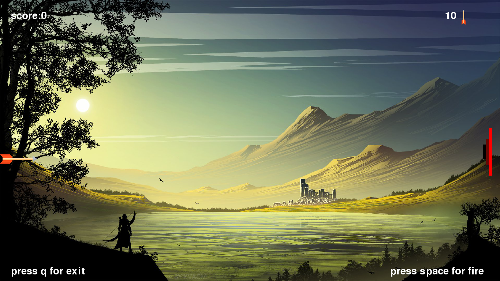
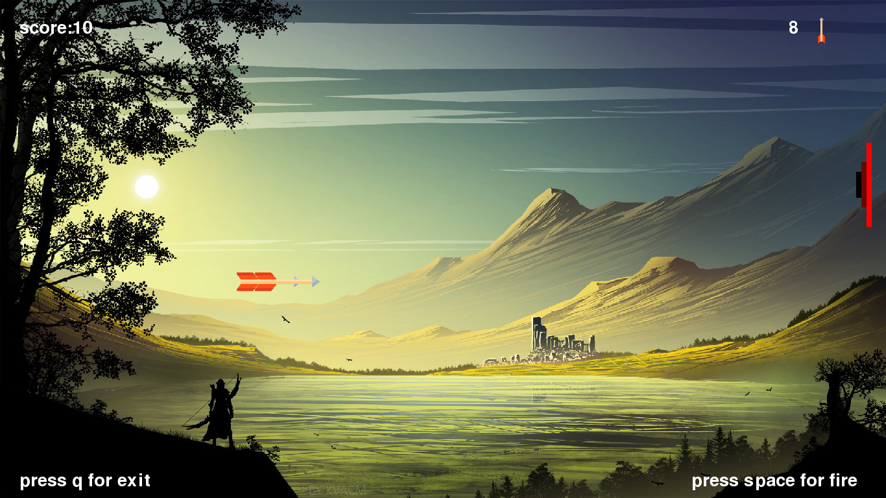

this is a Archery game using pygame .if you are also intersted in making games ,you should start with this .This is very easy to learn
  
- # Requirements

   1. ### **python**
    
    Now days python is a trending programming languages it provides more features than other programming languages and clean synthax

    You can download from here [python](https://www.python.org/downloads/)

   2. ### **IDE**

    An IDE (or Integrated Development Environment) is a program dedicated to software development. As the name implies, IDEs integrate several tools specifically designed for software development. These tools usually include: An editor designed to handle code (with, for example, syntax highlighting and auto-completion)

    There are many IDEs are available specially i use **pycham** you can download from [Here](https://www.jetbrains.com/pycharm/download/)
   
    3. ### **Module**

    first you need pygame for making games in python.You simply download by command Promt or Powershell by typing 
    
    ```
    pip3 install pygame 
    ```
    for linux you can install by
    ```
     sudo apt-get install python-pygame
     ```


    In this game i use  screeninfo module to get system screen resolution You Can install by typing 

    ```
    pip3 install screeninfo
    ```
    for linux you can install by
    ```
     sudo apt-get install python-screeninfo
     ```

# _DEMO_
images






  
    
